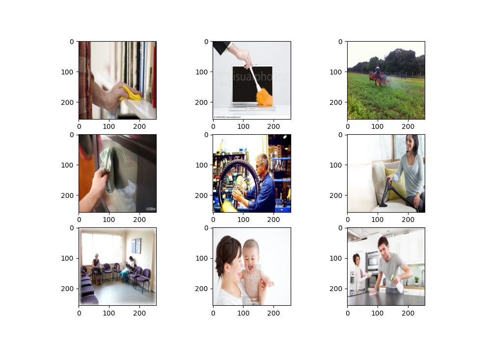

# Image Classification with Keras & Scikit-Learn

The code in this repository is designed for image classification using keras, and scikit-Learn. It offers functionality for loading image data, splitting it into training and testing sets, implementing data augmentation techniques, creating models, and tuning hyperparameters using scikit-learn's KerasClassifier.

To run the code, the following packages are required:

- [ ] numpy
- [ ] argparse
- [ ] matplotlib
- [ ] skimage
- [ ] scikit-learn
- [ ] tensorflow

The code defines several default values that can be adjusted:

- DIR_PATH_DEFAULT: The path to the directory containing the images
- CLASS_NAME_DEFAULT: The name of the positive class
- TEST_SIZE_DEFAULT: The fraction of the data that should be used for testing
- NUM_IMG_DEFAULT: The number of images to display for visualization
- IMG_SIZE_DEFAULT: The size of the images after resizing
- FLIP_TYPE_DEFAULT: The direction of random image flips
- ROTATION_VALUE_DEFAULT: The degree of random image rotations
- ZOOM_VALUE_DEFAULT: The degree of random image zooms

*Figure 1: Dataset sample.*
